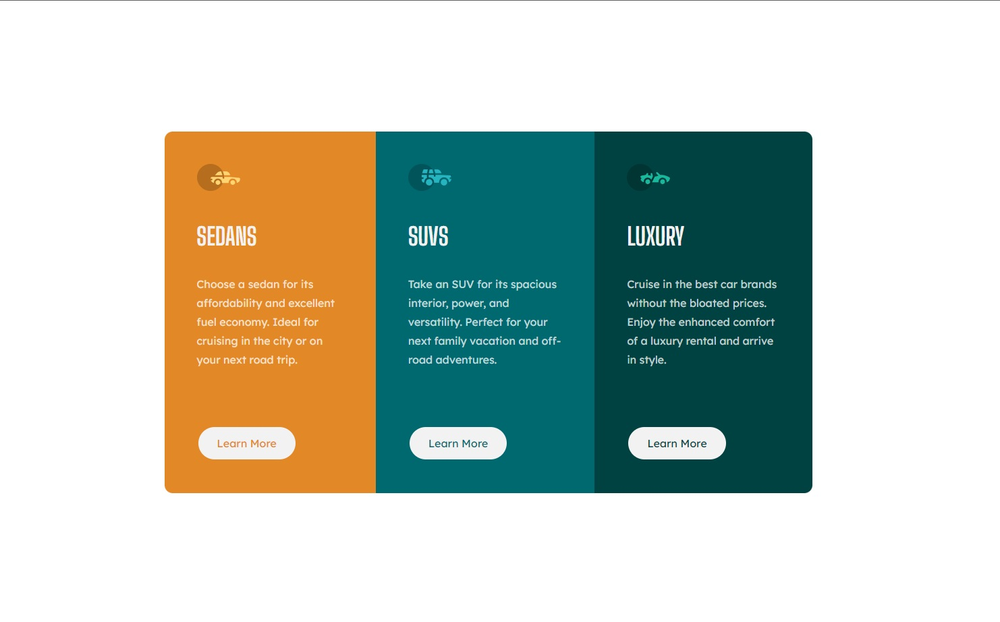

# Frontend Mentor - 3-column preview card component solution

This is a solution to the [3-column preview card component challenge on Frontend Mentor](https://www.frontendmentor.io/challenges/3column-preview-card-component-pH92eAR2-).

## Table of contents

- [Overview](#overview)
  - [The challenge](#the-challenge)
  - [Screenshot](#screenshot)
  - [Links](#links)
- [My process](#my-process)
  - [Built with](#built-with)
  - [What I learned](#what-i-learned)
  - [Useful resources](#useful-resources)
- [Author](#author)

## Overview

### The challenge

Users should be able to:

- View the optimal layout depending on their device's screen size
- See hover states for interactive elements

### Screenshot

### Links

- Solution URL: [Solution URL](https://github.com/Grathienbeto/three-columns-card)
- Live Site URL: [Live site URL](https://your-live-site-url.com)

## My process

### Built with

- Semantic HTML5 markup
- CSS custom properties
- Mobile-first workflow
- [Tailwind](https://tailwindcss.com/) - For styles

### What I learned

First time using Tailwind, and...it was a journey. Take a little time to get used to it. I will give it another try that's for sure.

### Useful resources

- [Tailwind installation](https://tailwindcss.com/docs/installation)
- [Tailwind Flex](https://tailwindcss.com/docs/flex#class-reference)

## Author

- Frontend Mentor - [@Grathienbeto](https://www.frontendmentor.io/profile/Grathienbeto)
- Twitter - [@betoluna89](https://twitter.com/betoluna89)
